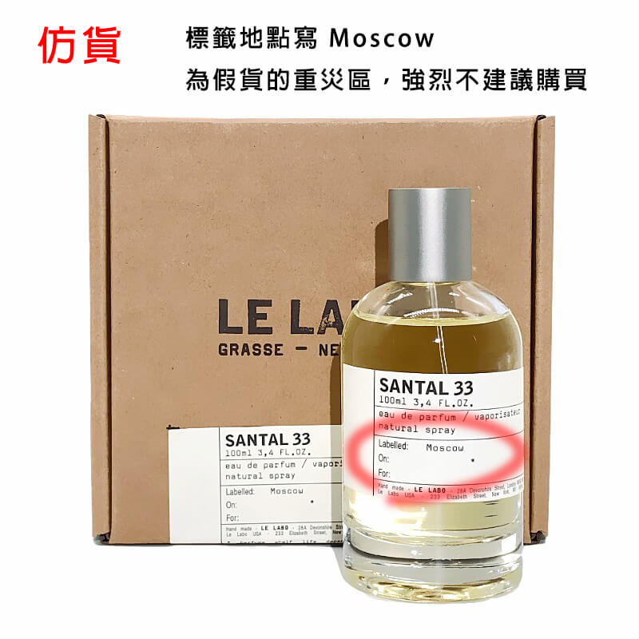
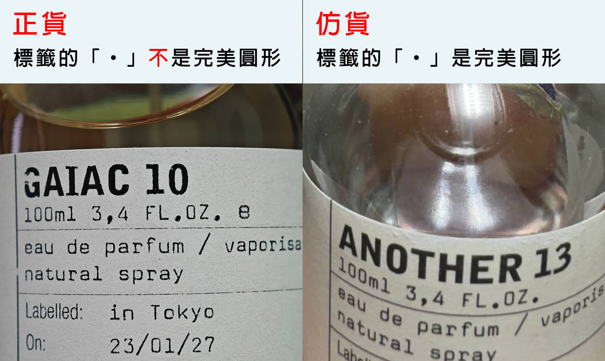
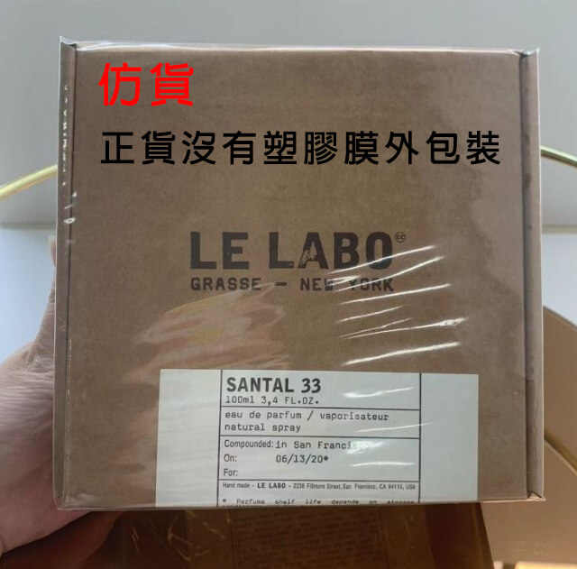

# Le Labo

--8<-- "refs.md"
--8<-- "header_warning.md"

## 瓶蓋

這個我認為並不是很準確，我手邊就有一個台北內湖 Le Labo 購買的香水，但是他的瓶蓋刻字有點像仿貨。

## 相對定價

正貨的 Le Labo 城市限定系列的價格，應該要明顯高於非城市限定系列。

例如賣家有賣 Gaiac 10 (東京10) ，那麼它的價格應該要 明顯高於 (x1.5 \~ x2) 非城市限定系列的價格。
如果價格和非城市限定系列的價格一樣，那幾乎可以肯定有問題。

## 標籤顏色

標籤本身為微黃的米白色，不反光。

## 標籤地點

- 標籤上的地點寫 Moscow 的不建議購買，仿貨的重災區。
- San Francisco 的確有正貨，但也曾是假貨的災區。

## 標籤字體

正貨的印刷不是完美的，多少會有些「破損感」。其中「,」和「.」都不是「完美」的。
字體也有些微的區別，正貨的「p」左上角是尖的，假貨是圓的。

## 包裝盒底

標籤上的英文說明不應該延續到盒底。

## 塑膠膜包裝

正貨「沒有」塑膠膜包裝。

## 噴頭底座

## 噴頭比例

## 參考資料

- https://attscent.com/le-labo-fake-fragrance/
- https://www.carousell.com.hk/p/1169964502/
