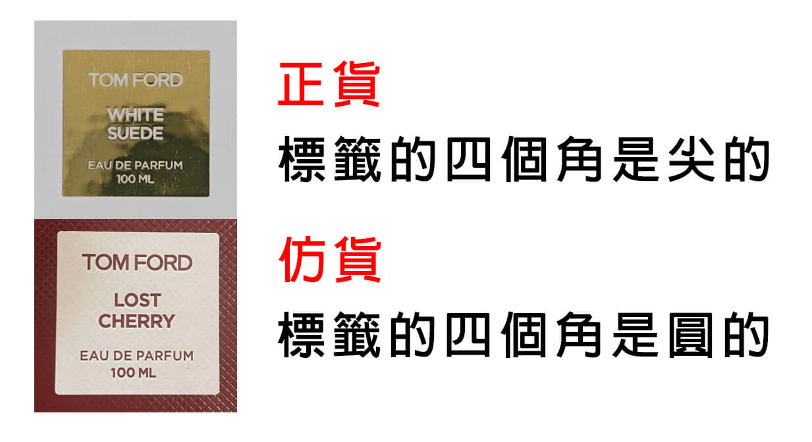

# Tom Ford

--8<-- "refs.md"
--8<-- "header_warning.md"

## 私人調香系列

### 六角形噴嘴

正貨的噴嘴是六角形的。如果是 100 ML 容量的，噴嘴上還會有數字（但肉眼看不清楚）。

### 標籤外觀

正貨的標籤角是尖的，有些假貨的標籤角會比較圓。
字體也有些許不同，不過字體沒對照組的話很難看出來。

### 絕對定價

您要知道您所購買的香型的官方定價。賣家以官方定價的三分之一，甚至更低的售價販售還賺錢那是不可能的。
但賣高價也並不代表就是正品，我就見過幾間代購以大約正品一半的售價在賣仿品，誰買誰倒楣…
請參考 [通用規則＃賣場背景圖][in-general-market-background-image] 。

### 相對定價

在私人調香系列的淡香精中，有幾隻是相對於其他明顯比較貴的。包括但不限於

- Electric Cherry (電光櫻桃)
- Fucking Fabulous (先聲奪人)
- Myrrhe Mystere (神秘曙光)
- Vanille Fatale (引誘香草)
- Vanille Sex (縱情香草)

### 錯誤的容量

某些私人調香的香型，是沒有 100 ML 版本的。包括但不限於

- Azure Lime (沁涼萊姆)
- Bois Marocain (雪松秘境)
- Electric Cherry (電光櫻桃)
- Fougere D'Argent (經典靈感)
- Myrrhe Mystere (神秘曙光)
- Neroli Portofino Parfum (暖陽橙花 香精)
- Oud Wood Perfum (神秘東方 香精)
- Santal Blush (忘憂聖壇)
- Vanille Fatale (引誘香草)
- Vanille Sex (縱情香草)

## 參考資料

- https://attscent.com/tom-ford-fake-fragrance/
