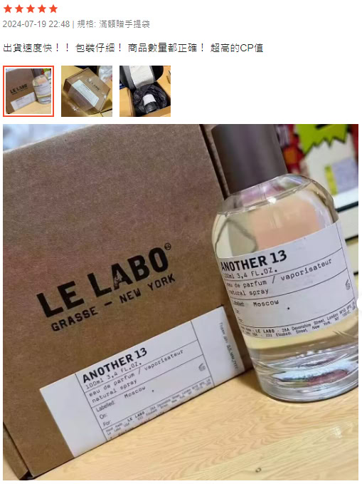
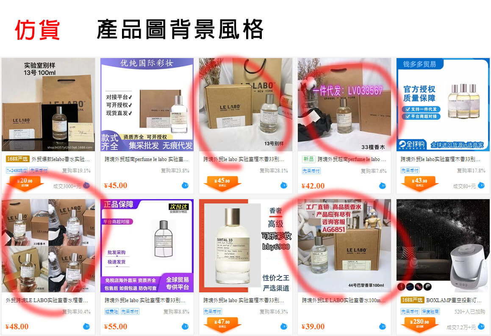

# 通用規則

--8<-- "refs.md"
--8<-- "header_warning.md"

## 賣場相關

- 價格過低，五分之一、十分之一的價格，你信是正貨嗎？
- 我曾聽過有些賣場會真貨仿貨混著賣，無解。
- 先看賣場的低分評價，是否有人抱怨是仿貨。
- 仿貨賣場通常沒有現貨。
- 仿貨賣場通常不願意提供實物的照片，只用網路上找到的照片。
- 仿貨賣場通常會用一些奇怪的說法來解釋價格，例如：工廠或員工流出
- 賣場曾經賣過仿貨的話，極可能整個賣場都是仿貨。
- 賣場的用字遣詞並非台灣的習慣。例如：`親`、`咨詢`、`賬號`
- 觀察那些有附上照片的買家評價。
  很多買家其實沒做過功課，不知道自己買到的是仿貨，但他們拍的照片有時候看得出來。
  我就從買家照片看過不少買家買到仿貨，還誇賣家態度很好給 5 星評價。
  注意，買家評價是可以洗的，所以我們只看買家提供的實物照片是否有仿貨。

    

## 商品背景圖

背景圖正常來說和是不是正貨無關，不過如果和仿貨源頭用一樣或相似的圖片，那就可疑了 🤔

在 1688 上搜尋仿貨關鍵字（例如：`越南`、`外贸`、`原单`），可以找到一瓶新台幣 200 不到的仿貨。
有些賣家甚至會拿這些仿貨當正貨賣，所以看價格其實不準，而且購證及品牌提袋也都是很容易仿冒的。

## 真瓶假香

少數不良賣家會收購真香的空瓶，然後灌入假香販售。

大部分正裝香水用的是一次性封口瓶，雖說可以硬把它撬開，但勢必會留下痕跡，不過賣家當然不會拍給你看 🤣
所以我覺得理論上，真瓶假香在網購時應該是無解的。
