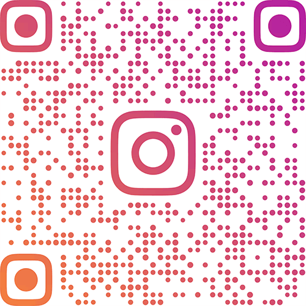
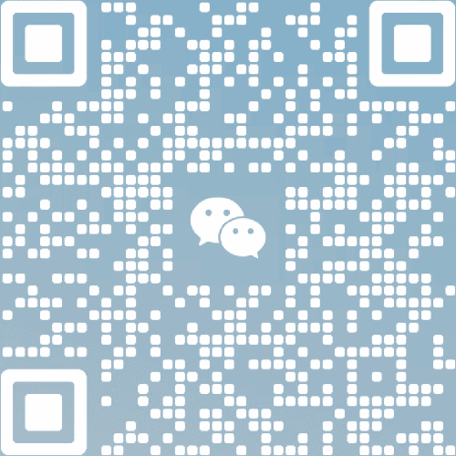

# 說明

僅記錄一些網路上已知的資訊結合手邊的實品，並不會有太多的原創內容，僅供參考。

## 關於我

只是一個喜歡香水的竹科工程師 🤠

本人亦有正品原裝與分裝香水的小小賣場，歡迎來逛逛

- 蝦皮購物： https://shopee.tw/jfcherng
- 旋轉拍賣： https://tw.carousell.com/u/jfcherng/

您也可以直接連絡我購買或詢問，省去賣場手續費。新竹市東區皆可面交當場驗貨。
您不一定要和我購買，但看到仿貨賣家賺錢我就不開心 🫠
因此在我比較熟悉的領域，我會盡量提供辨識方式，祝您好運。

## 聯絡方式

| Instagram | LINE | 微信 (WeChat) |
| ---- | ---- | ---- |
|  |  |  |

## 好用網站

### 查香水氣味以及評價

- https://www.nosetime.com （較偏向東方人的觀點）
- https://www.fragrantica.asia （較偏向西方人的觀點）
