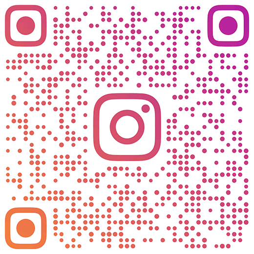
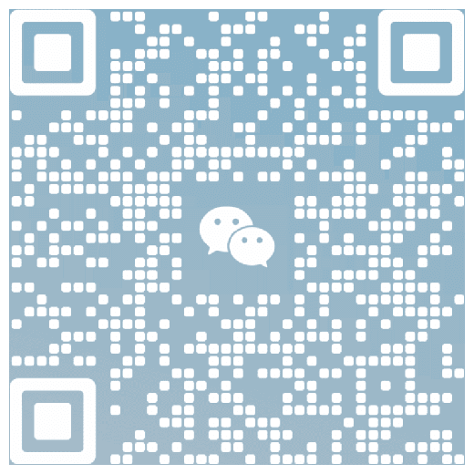

# 說明

記錄一些網路上已知的資訊結合手邊的實品，並不會有太多的原創內容，僅供參考。

## 關於我

Hi 我是 Jack ，一個喜歡香水的竹科 IC 廠工程師 🤠，網路上常用的 ID 是 `jfcherng` 。

小弟有香水試香、正裝與分享香的小賣場，歡迎來逛逛：

- 蝦皮購物： https://shopee.tw/jfcherng
- 旋轉拍賣： https://tw.carousell.com/u/jfcherng/

您也可以直接連絡我購買，省去網路賣場的手續費（蝦皮 7.5%; 旋轉 2.5%）來得到更實惠的價格。
若您仍有疑慮，所有正裝、簡裝商品都可以在新竹市東區或竹北面交驗貨，甚至約巨城專櫃當場比較也行。

小弟有長期合作的海外 Tom Ford 專櫃，價格甜但交貨時間較長，有興趣的可以聊聊詢問。
其他品牌的香水也可以問問，有問有機會～

## 關於仿貨

!!! warning "注意"
    本站所羅列的識別方式僅供參考，就當作是我的個人信仰，並不具有法律上的效力。
    您可以選擇相信我的個人信仰，但我不會介入您與仿貨賣家的爭議，也不會為您背書。

!!! tip "一起來寫"
    如果您有興趣共同編輯這系列的文章，
    或是想要提供識別方式，歡迎與我聯絡。
    或是您熟悉 GitHub 的話，直接發起 pull request 也可以。

如果您打算在網路上購買不管是全新香水亦或是二手香水，建議您先看看有沒有正貨的識別方式。

看到仿貨賣家爽賺我就不開心，就是這些人搞爛網拍的信任度 😠
在我比較熟悉的幾個品牌，盡量提供識別方式，能救一個是一個，說不定我還能因此有生意 😆
因為仿貨而誤會了正貨香水的氣味，那真是太可惜了…

## 我的香水群組

各種品牌不定期隨機開團（正裝、簡裝、分裝）或隨時私訊詢問，群組內閒聊也歡迎。

## 聯絡方式

| Instagram | LINE | 微信 (WeChat) |
| ---- | ---- | ---- |
|  |  |  |

## 好用網站

### 香水時代

網址： https://www.nosetime.com

應該是中文圈裡最大的香水資料庫了，沒有微信的話稍微不便。內容較偏向東方人的觀點。
查詢香水時，還是比較建議用英文名稱查，因為兩岸的中文譯名可能會有所不同。

### FRAGRANTICA

網址： https://www.fragrantica.com

應該歐美圈裡最大的香水資料庫了。內容較偏向西方人的觀點，他們對氣味的描述可能會和東方人不太一樣。
例如我們說這味道像是「當歸」，但是西方大部分人沒有接觸過「當歸」，那他們可能就會用其他方式來描述它。

!!! tip "小技巧"
    有時候因為預算問題會想找的平價替代品（平替），也可以在裡面找到。
    香水的下面會有「This perfume reminds me of」的名單，即為可能的替代品。

### CheckFresh

網址： https://www.checkfresh.com

用香水的批號來查詢它的製造日期。

!!! info "小知識"
    台灣法律規定必須標示保存期限，但我認為香水本身是沒有所謂的「保存期限」的。
    因為香水本身幾乎都是酒精，微生物無法生存，也就不會「壞掉」，只會因為保存不當而變質。
    （連食鹽都得標保存期限，難道是壞了嗎？顯然不是，它一直都是氯化鈉。）
